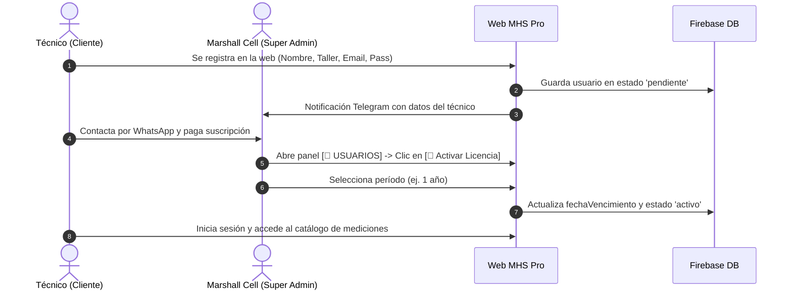

# Plan de Futura Implementación: Sistema de Licencias Comerciales, Mediciones Locales y Bandeja de Aportes
**Fecha y Hora:** 20 de Septiembre de 2026 - 21:45
**Plataforma:** Marshall Hardware Suite™ (MHS Pro) / Marshall Cell
**Estado:** Documentación Técnica de Futura Implementación

---

## 1. Visión General del Negocio

Convertir **Marshall Hardware Suite™ (MHS Pro)** en una plataforma profesional SaaS (*Software as a Service*) de diagnóstico para talleres de microelectrónica y reparación de telefonía móvil.

El sistema permitirá:
1. **Comercialización de Licencias:** Acceso temporal o permanente controlado mediante fechas de vigencia automáticas.
2. **Mediciones Locales para el Técnico:** Cada usuario con licencia puede registrar y guardar sus propias mediciones en su espacio personal de trabajo sin alterar la base de datos maestra.
3. **Bandeja de Aportes y Contraste:** Los técnicos pueden enviar mediciones sugeridas a Marshall Cell. El propietario las contrasta en su laboratorio con su multímetro y, si son válidas, las aprueba e incorpora a la base de datos oficial.

---

## 2. Modelo de Licenciamiento Comercial

### Tipos de Licencia
* **Licencia Mensual:** 30 días de acceso completo.
* **Licencia Trimestral / Semestral:** 90 / 180 días.
* **Licencia Anual (Recomendada):** 365 días de soporte y actualizaciones.
* **Licencia Vitalicia (Lifetime / VIP):** Acceso permanente sin fecha de expiración.

### Esquema de Datos en Firestore (`usuarios/{uid}`)
```javascript
{
  uid: "X89kL019283...",
  nombre: "Carlos Gómez",
  taller: "ElectroCell Reparaciones",
  telefono: "+51 987654321",
  email: "carlos@electrocell.com",
  rol: "tecnico",            // "tecnico" | "editor" | "super_admin"
  estado: "activo",          // "activo" | "pendiente" | "vencido" | "bloqueado"
  licencia: {
    tipo: "anual",           // "mensual" | "trimestral" | "anual" | "vitalicia"
    fechaInicio: "2026-09-20T21:45:00.000Z",
    fechaVencimiento: "2027-09-20T21:45:00.000Z",
    diasRestantes: 365,
    activa: true,
    activadaPor: "andres.novus59249@gmail.com"
  },
  fechaRegistro: "2026-09-20T21:40:00.000Z"
}
```

---

## 3. Flujo Operativo de Venta y Activación



### Pantalla de Vencimiento de Licencia
Cuando la fecha actual supera a `fechaVencimiento`:
* El estado del usuario pasa a ser evaluado como **Licencia Vencida**.
* La plataforma despliega un modal elegante que impide la consulta de esquemas y muestra:
  * *"Tu período de licencia venció el [Fecha]"*.
  * Botón directo: **`[ 💬 Contactar a Marshall Cell por WhatsApp para Renovar ]`**.

---

## 4. Mediciones Locales vs. Base de Datos Maestra

Para garantizar que ningún usuario externo pueda corromper o sobrescribir las lecturas verificadas de Marshall Cell:

### A. Capa Maestra (Golden Master DB - Solo Marshall Cell)
* Colección: `hardware_db`
* Solo modificable por usuarios con rol `super_admin` o `editor` de absoluta confianza.
* Contiene los valores de referencia oficiales y fotos calibradas.

### B. Capa de Mediciones Locales del Técnico
* Subcolección: `usuarios/{uid}/mis_mediciones/{modeloId}`
* El técnico puede anotar los valores de los teléfonos de sus clientes que está midiendo en su taller.
* Permite comparar sus lecturas contra las lecturas maestras de Marshall Cell con alerta de color:
  * **Verde:** Coincide con el valor maestro (±10% tolerancia).
  * **Rojo:** Cortocircuito (0.000V) o Línea abierta (OL).
  * **Amarillo:** Fuera de rango.

---

## 5. Sistema de "Bandeja de Aportes y Contraste"

Inspirado en los mejores sistemas colaborativos de la industria (ZXW / Borneo):

1. **Envío del Aporte:**
   * En la interfaz del técnico, junto a cada línea o pad, se coloca el botón:  
     `[ 📤 Sugerir valor a Marshall Cell ]`.
   * El técnico envía: Modelo, Conector/Línea, Escala, Valor medido y Foto/Comentario opcional.
2. **Recepción en Bandeja de Entrada del Super Admin:**
   * Colección: `aportes_pendientes`
   * En el panel de Marshall Cell aparece una pestaña: **`[ 📥 Aportes de la Comunidad ]`**.
3. **Filtro de Calidad por Marshall Cell:**
   * Andrés / Marshall Cell revisa la placa física en su microscopio/multímetro.
   * Si la medición es exacta, presiona:  
     **`[ ✅ Aprobar e incorporar a la Base de Datos Maestra ]`**.
   * El sistema acredita automáticamente al técnico (ej: *"Aporte verificado por Marshall Cell - Colaboración: Taller ElectroCell"*).

---

## 6. Hoja de Ruta para su Implementación

1. **Fase 1 (Próxima etapa):**
   * Añadir selector de duración de licencia en el panel `ModalGestionUsuarios.js` (1 mes, 3 meses, 1 año, permanente).
   * Validar fecha de expiración en `pages/index.js` antes de renderizar mediciones.
2. **Fase 2:**
   * Implementar el almacenamiento local/privado de lecturas del técnico.
3. **Fase 3:**
   * Desarrollar la bandeja de aportes comunitarios con botón de validación 1-clic para el Super Admin.
